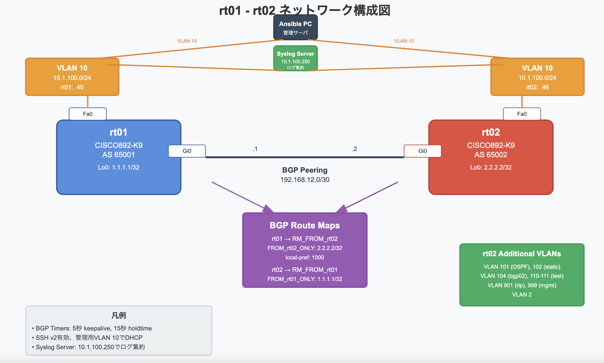

# Cisco C890ルータ構成自動化（Ansible + ChatGPT）※Private用

このリポジトリは、ネットワーク機器（主にCisco C890シリーズ）の構成を **Ansible** を使って自動化するPlaybookとRoleを管理するものです。  
構成や変数設計の大部分は、**ChatGPTを活用しながら作成**しました。

---

## 対象構成

本Playbook（`playbooks/c890_ebgp.yml`）は、以下のようなCisco C890ルータ2台（rt01 / rt02）のBGP構成を自動化対象としています。

- **BGP Peering**：AS65001（rt01）とAS65002（rt02）  
- **VLAN10でDHCP・SSHによる管理**  
- **ルートマップで受信ルートを制御**  
- **各種VLAN・インターフェース設定、ログ転送設定（Syslog）**

---

## 📷 構成図

例：



---

## ディレクトリ構成（`tree` コマンド）

```bash
tree
.
├── inventory/
│   ├── group_vars/
│   │   ├── cisco_c890.yml           # 共通設定（非機密）
│   │   └── cisco_c890_vault.yml     # 機密情報（Vault暗号化済み）
│   ├── host_vars/
│   │   ├── rt01.yml                 # 個別設定（IPなど）
│   │   └── rt02.yml
│   └── hosts.ini
├── playbooks/
│   └── c890_ebgp.yml                # 実行Playbook
├── roles/                           # Roleごとに処理分割
│   ├── common/
│   ├── vlan/
│   ├── interface/
│   ├── ip_prefix_list/
│   ├── route_map/
│   └── bgp/
```

---

## 変数の分離について

- 共通設定は `group_vars/cisco_c890.yml` に記載  
- 個別設定（IPアドレスなど）は `host_vars/rt01.yml` などに分離  
- 機密情報（SSHパスワード、enable passwordなど）は `group_vars/cisco_c890_vault.yml` にVaultで暗号化して管理

---

### `cisco_c890_vault.yml` の中身（復号後）

```yaml
ansible_user: runsuru
ansible_password: cisco123
enable_password: cisco123
peer_password: 045802150C2E1D1C5A
```

---

### 編集方法

```bash
ansible-vault edit inventory/group_vars/cisco_c890_vault.yml
```

---

### Vaultパスワード自動指定（推奨）

```bash
echo 'cisco123' > ~/.vault_pass.txt
chmod 600 ~/.vault_pass.txt
```

---

## Playbookの実行方法

```bash
ansible-playbook -i inventory/hosts.ini playbooks/c890_ebgp.yml   --vault-password-file ~/.vault_pass.txt
```

### オプション：

- `-l rt01` などで対象ホストを限定実行可能  
- `-k -u runsuru` を指定して明示ログインも可能（SSHパスワード方式の場合）

---

## 注意事項（Disclaimer）

⚠️ 本Playbookの使用によって発生した損害・障害などについて、作者は一切の責任を負いません。  
⚠️ *Use at your own risk. The author is not responsible for any damage or failure caused by using this Playbook.*

